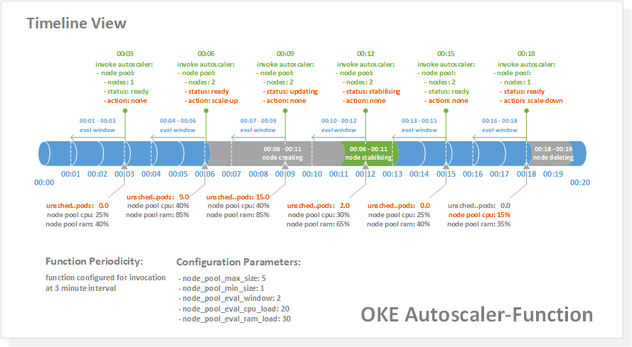

[oci]:https://cloud.oracle.com/en_US/cloud-infrastructure
[oke]:https://cloud.oracle.com/containers/kubernetes-engine
[oci-signup]:https://cloud.oracle.com/tryit

# OKE Cluster Autoscaler Function

## Introduction
The OKE Cluster Autoscaler Function provides an automated mechanism to scale OKE clusters by adding or removing nodes from a node pool. When you enable the autoscaler function, you don't need to manually add or remove nodes, or over-provision your node pools. Instead, you specify a minimum and maximum size for the node pool, and the rest is automatic.

The autoscaler function automatically adjusts the size of the Kubernetes cluster when one of the following conditions is true:

- there are pods that have failed to run in the cluster due to insufficient resources;
- nodes in the node pool have been underutilized for an extended period of time

[Oracle Container Engine for Kubernetes][oke] (OKE) is a developer friendly, container-native, and enterprise-ready managed Kubernetes service for running highly available clusters with the control, security, and predictable performance of Oracle’s Cloud Infrastructure.

*OKE nodes are hosts in a Kubernetes cluster (individual machines: virtual or bare metal, provisioned as Kubernetes worker nodes). OKE nodes are deployed into logical groupings known as node pools. OKE nodes run containerized applications in deployment units known as pods. Pods schedule containers on nodes, which utilize resources such as CPU and RAM.*

By default the autoscaler function implements only the scale-up feature, scale-down is an optional feature.

> _See the [Limitations](##Limitations) section herein for important considerations and limitations that should be understood before implementing the cluster autoscaler function._

## Overview
The autoscaler function is implemented as an Oracle Function (i.e. an OCI managed serverless function):

 - the Oracle Function itself is written in Python: [oke-autoscaler/func.py]( /oke-autoscaler/func.py)
 - the function uses a custom container image based on oraclelinux:7-slim, and also includes  rh-python36, the OCI CLI, and kubectl: [oke-autoscaler/Dockerfile]( /oke-autoscaler/dockerfile)



### Evaluation Logic
When the function is invoked, it follows an order of operation as follows:

1. evaluates the state of the node pool, to ensure that the node pool is in a stable condition
2. if the node pool is determined to be mutating (e.g. in the process of either adding or deleting a node, or stabilizing after adding a node), the autoscaler function will exit without performing any further operation
3. if the node pool is in a stable condition, scale-up is evaluated first
4. if scale-up is not triggered, the autoscaler function evaluates for scale-down (where scale-down has been enabled by the cluster administrator)

### Scheduling
The autoscaler function is designed to be invoked on a recurring schedule.
The periodicity by which the function is scheduled to be invoked is configurable. As a starting point, consider scheduling the autoscaler function to be invoked at an interval of every 3 minutes.

Once invoked, the function will run in accordance with the [Evaluation Logic](##Evaluation Logic) described herein.

A dimension to consider is the length of the window of time that the function will use to calculate the average resource utilization in the node pool.

The cluster administrator assigns a value to the function custom configuration parameter `node_pool_eval_window`.
The autoscaler function implements `node_pool_eval_window` as the number of minutes over which to:

 - calculate the average CPU & RAM utilization for the node pool when evaluating for scale-down

`node_pool_eval_window` is by default is intended to represent the number of minutes between each invocation of the function, i.e. the periodicity of the function.
In the case where the autoscaler function is scheduled for invocation every 3 minutes, setting `node_pool_eval_window` to 3 minutes will configure the autoscaler function to use the 3 minutes lapsed since the previous invocation as the window of time to evaluate and node pool utilization metrics.

`node_pool_eval_window` does not need to match the function invocation schedule, and can be set to calculate resource utilization over either a longer or shorter window of time.

### Scaling
The cluster administrator defines what the node pool maximum and minimum number of nodes should be. The autoscaler function operates within these boundaries.

#### Scale-Up
The autoscaler function queries the cluster to enumerate the number of pods for the given node pool which are in a `Pending` state, and are flagged as being in an `Unschedulable` condition.

The number of pods flagged as being `Unschedulable` will be greater than zero when there are insufficient resources in the cluster on which to schedule pods. This condition will trigger the autoscaler function to scale-up the node pool by adding an additional node.

> _The scale-up feature is enabled by default._

#### Stabilization
During the period immediately after a new node becomes active in a node pool, the cluster may still report some pods as being `Unschedulable` - despite the fact that the cluster has introduced enough resource to support the desired state.

In order to prevent a premature scale-up event, the autoscaler function implements a node pool stabilization window to fence off the node pool from any modification during the period immediately after the addition of a new node. The node pool stabilization widow is implemented to afford the cluster the required time to schedule the backlog of unschedulable pods to the new node.

Where the autoscaler function is invoked during the stabilization window, and it detects the presence of `Unschedulable` pods - a scale-up event will not be triggered.

#### Scale-Down
The cluster administrator defines as a percentage, the average node pool CPU and/or RAM utilization that below which the autoscaler function will scale-down the node pool by deleting a node.

The autoscaler function calculates the node pool average CPU and RAM utilization as a mean score expressed as a percentage, which is derived by obtaining average utilization across all nodes in the node pool.

The calculated node pool averages for CPU and/or RAM utilization are evaluated against the percentage based thresholds provided by the cluster administrator.

If the node pool average CPU and/or RAM utilization is less than the thresholds provided by the cluster administrator, the node pool will scale-down.

Administrator defined scale-down thresholds can be set to evaluate for:

- node pool average CPU utilization
- node pool average RAM utilization
- either node pool average CPU or RAM utilization

When a specified scale-down condition is met, the autoscaler function will cordon and drain the worker node, then calls the Container Engine API to delete the node from the node pool.

> _Enabling the scale-down feature is optional._

## Limitations
The autoscaler function has the following limitations:

- The content is provided for example only; Oracle will not provide direct support for this example
 - This function should not be configured for invocation on a recurring schedule with an interval less than 2.5 minutes
 - The function scale-down feature is not designed for use in clusters scheduling stateful workloads that utilise Local PersistentVolumes
 - The function initiates a call to the Container Engine API `updateNodePool()` to scale, which can take several minutes to complete
 - The function cannot wait for the `updateNodePool()` operation to complete, the cluster administrator will need to monitor the success or failure of the operation outside of the function

If resources are deleted or moved when autoscaling your node pool, workloads might experience transient disruption. For example, if the workload consists of a controller with a single replica, that replica's pod might be rescheduled onto a different node if its current node is deleted.

Before enabling the autoscaler function scale-down feature, workloads should be configured to tolerate potential disruption, or to ensure that critical pods are not interrupted.

## Implementation
The implementation instruction is implemented in two parts:

 - the first section describes implementation of the cluster autoscaler function with scale-up enabled
 - the second section describes additional configuration required to enable scale-down

Resources referenced in this tutorial will be named as follows:

 - Compartment containing the OKE Cluster: ***Demo-Compartment***
 - OCI IAM Dynamic Group Name: ***FnFunc-Demo***
 - Oracle Functions Application Name: ***oke-autoscaler***
 - Function Name: ***oke-autoscaler***
 - Kubernetes service account name: ***oke-autoscaler***
 - Kubernetes cluster role binding name: ***oke-autoscaler***

### Multiple Node Pools

The autoscaler function supports clusters which contain multiple node pools. For a given cluster hosting multiple node pools, autoscaler functions can be enabled for one or more of the associated node pools.

In the following implementation example, the Oracle Functions autoscaler application `oke-autoscaler` hosts a single function, named `oke-autoscaler`. In a real-life scenario, a cluster administrator may have a number of node pools for which she/he might want to enable the autoscaler function.  
In this case, it's possible to implement the application `oke-autoscaler` as hosting multiple individual functions - each in service of a different node pool. Here, include in the name of each function an identifier that correlates the function with the specific cluster and node pool that it manages.

### Kubernetes Labels

When provisioning worker nodes, OKE applies a set of default labels to each new node. By default, the label `name` is applied to each node, with the associated value as the name of the node pool.

In order to ensure correct operation of the autoscaler function, it is necessary that the `name` label be present, and correctly configured for all nodes in a managed node pool.

### Scale-Up

#### Prerequisites
The following should be completed before going ahead and creating the autoscaler function:
 - **OCI Tenancy:** If you don't already have an OCI tenancy, you can sign-up right [here](https://www.oracle.com/cloud/free/) and experience the benefits of OCI with the included always free services
 - **Set up your tenancy for function development:** Follow the link to [this tutorial](https://docs.cloud.oracle.com/iaas/Content/Functions/Tasks/functionsconfiguringtenancies.htm) for guidance on the process
 - **Configure your client environment for function development:** Before you can start using Oracle Functions to create and deploy functions, you need to set up your client environment for function development: follow the link to [this tutorial](https://docs.cloud.oracle.com/iaas/Content/Functions/Tasks/functionsconfiguringclient.htm) for guidance on the process

#### Additional IAM Policies

When a function you've deployed to Oracle Functions is running, it can access other Oracle Cloud Infrastructure resources. To enable a function to access another Oracle Cloud Infrastructure resource, you need to include the function in a dynamic group, and then create a policy to grant the dynamic group access to that resource. Follow the link to [this tutorial](https://docs.cloud.oracle.com/iaas/Content/Functions/Tasks/functionsaccessingociresources.htm) for guidance on creating a dynamic group. 

For our deployment scenario we'll require our "FnFunc-Demo" dynamic group to access a range of services, including OKE and Monitoring. To enable this, create the following dynamic group and additional IAM policies:

#### Dynamic Group
For the below dynamic group definition, the `resource.compartment.id` is that of the "Demo-Compartment" where the application and associated function will be deployed:
```
ALL {resource.type = 'fnfunc', resource.compartment.id = 'ocid1.compartment.oc1..aaaaaaaafnaar7sww76or6eyb3j625uji3tp4cb4tosaxx4wbxvvag4dkrra'}
```

#### IAM Policies
Create the additional IAM policies:
```
Allow dynamic-group FnFunc-Demo to manage cluster-family in tenancy
Allow dynamic-group FnFunc-Demo to manage metrics in tenancy
Allow dynamic-group FnFunc-Demo to manage instance-family in compartment Demo-Compartment
Allow dynamic-group FnFunc-Demo to use subnets in compartment Demo-Compartment
Allow dynamic-group FnFunc-Demo to read virtual-network-family in compartment Demo-Compartment
Allow dynamic-group FnFunc-Demo to use vnics in compartment Demo-Compartment
Allow dynamic-group FnFunc-Demo to inspect compartments in compartment Demo-Compartment
Allow dynamic-group FnFunc-Demo to use secret-family in compartment Demo-Compartment
```

#### Cluster Service Account

To provide the autoscaler function access to the cluster in order to evaluate and manipulate the cluster state - it's required that a long-lived, non-user-specific authentication token be generated and made accessible to the autoscaler function at runtime.

Follow [this work instruction](https://docs.cloud.oracle.com/en-us/iaas/Content/ContEng/Tasks/contengaddingserviceaccttoken.htm) to create a cluster service account, clusterrolebinding, and obtain the base64 decoded service account token.

Record the value of the base64 decoded service account token for later use, as this string will be saved as a Secret in the OCI Vault service.

Use the following to name the service account and clusterrolebinding:

 - service account name: `oke-autoscaler`
 - clusterrolebinding name: `oke-autoscaler`

For example:

``` bash
kubectl -n kube-system create serviceaccount oke-autoscaler
kubectl create clusterrolebinding oke-autoscaler --clusterrole=cluster-admin --serviceaccount=kube-system:oke-autoscaler
```

#### OCI Secret

Follow [this work instruction](https://docs.cloud.oracle.com/en-us/iaas/Content/KeyManagement/Tasks/managingsecrets.htm#) to create the secret to be used by the autoscaler function. The secret content should be the base64 decoded service account token.

The secret should be created in the compartment:  `Demo-Compartment`.

Once complete, record the secret OCID.

### Create Oracle Functions Application: `oke-autoscaler`

In Oracle Functions, an application is a logical grouping of functions & a common context to store configuration variables that are available to all functions in the application. 

Now create an application named `oke-autoscaler` to host the `oke-autoscaler` function. Follow the link to [this tutorial](https://docs.cloud.oracle.com/iaas/Content/Functions/Tasks/functionscreatingapps.htm) for guidance on the process.

*When creating applications, Oracle recommends that you use the same region as the Docker registry that's specified in the Fn Project CLI context, and be sure to select the compartment specified in the Fn Project CLI context.*

### Create Function: `oke-autoscaler`
Now to create the function.  

#### Clone the `oke-autoscaler` Git Repository
First, let's clone the `oke-autoscaler` repository:

```
$ git clone https://nnn/oke-autoscaler.git
```

Commands from this point forward will assume that you are in the `../oke-autoscaler` directory, which is the directory containing the function code, and other dependencies such as the Dockerfile used to build the container image, the func.yaml (function configuration file), and a Python requirements definition file.

### Create the Function
Enter the following single Fn Project command to build the function and its dependencies as a Docker image, push the image to the specified Docker registry, and deploy the function to Oracle Functions:

```
$ fn -v deploy --app oke-autoscaler
```

The Fn Project CLI will generate output similar to the following (abbreviated) detailing the steps taken to build and deploy the function.
```
$ Deploying oke-autoscaler to app: oke-autoscaler
$ Bumped to version 0.0.1
$ Building image...
$ ...
$ ...
$ 0.0.1: digest: sha256:71c0f9fac6164b676b781970b5d79b86a28838081c6ea88e00cc1cf07630ccc6 size: 1363
$ Updating function oke-autoscaler using image iad.ocir.io/tenancy/fnbilling/oke-autoscaler:0.0.1...
```

### Implement Function Configuration Parameters
Now that we have our function built and deployed - it requires the creation of a number of configuration parameters in order for it to operate successfully. User defined configuration parameters are made available to the function at runtime via key-value pairs known as custom configuration parameters.

The autoscaler function requires that each of the custom configuration parameters be set. Invoking the function without passing all custom configuration parameters will cause the function to exit without evaluating the node pool for any scale condition.

To specify custom configuration parameters using the Fn Project CLI, the following command format is used:
```
$ fn config function <app-name> <function-name> <key> <value>
```

Create the following custom configuration parameters using the config function command:

*-- OKE Cluster ID*

```
$ fn config function oke-autoscaler oke-autoscaler cluster_id <value>
```
 - Type: String
 - The `<value>` field should contain the OKE Cluster OCID.

*-- OKE Node Pool ID*

```
$ fn config function oke-autoscaler oke-autoscaler node_pool_id <value>
```
 - Type: String
 - The `<value>` field should contain the OKE Node Pool OCID.

*-- Evaluation Window*

```
$ fn config function oke-autoscaler oke-autoscaler node_pool_eval_window <value>
```
 - Type: Int
 - The `<value>` configures the window of time in minutes, over which to evaluate node pool utilization metrics.
 - See the [Scheduling](###Scheduling) section herein for further detail.

*-- Node Pool Maximum Size*
```
$ fn config function oke-autoscaler oke-autoscaler node_pool_max_size <value>
```
 - Type: Int
 - The `<value>` field should contain the maximum number of nodes permitted to run in the node pool.

*-- Node Pool Minimum Size*
```
$ fn config function oke-autoscaler oke-autoscaler node_pool_min_size <value>
```
 - Type: Int
 - The `<value>` field should contain the minimum number of nodes permitted to run in the node pool. Should be greater than or equal to 1.
 - Set to zero where implementing scale-up feature only.

*-- Secret ID*

```
$ fn config function oke-autoscaler oke-autoscaler secret_id <value>
```

 - Type: String
 - The `<value>` field should contain the cluster service account secret OCID.

*-- Node Pool CPU Load Threshold*

```
$ fn config function oke-autoscaler oke-autoscaler node_pool_eval_cpu_load <value>
```

 - Type: Int
 - The `<value>` field should contain as a percentage, the average node pool CPU utilization that below which the autoscaler function will scale-down the node pool by deleting a node.
 - Set to zero to disable scale-down evaluation on node pool CPU utilization.

*-- Node Pool RAM Load Threshold*

```
$ fn config function oke-autoscaler oke-autoscaler node_pool_eval_ram_load <value>
```

 - Type: Int
 - The `<value>` field should contain as a percentage, the average node pool RAM utilization that below which the autoscaler function will scale-down the node pool by deleting a node.
 - Set to zero to disable scale-down evaluation on node pool RAM utilization.

> _To disable scale-down feature entirely – set both node_ram_load_threshold & node_cpu_load_threshold to be zero._

### Scale-Down
To enable the scale-down function, continue following the configuration steps outlined in this section.  
If you wish to utilize scale-up only, skip this section and move forward to the [Configure Function Logging](###Configure Function Logging) section herein.

##### Function Configuration Parameters
To configure and enable the scale-down feature, update the following function configuration parameters:

*-- Node Pool Minimum Size*
```
$ fn config function oke-autoscaler oke-autoscaler node_pool_min_size <value>
```
 - Type: Int
 - The `<value>` field should contain the minimum number of nodes permitted to run in the node pool. Should be greater than or equal to 1.

*-- Node Pool CPU Load Threshold*
```
$ fn config function oke-autoscaler oke-autoscaler node_pool_eval_cpu_load <value>
```
 - Type: Int
 - The `<value>` field should contain as a percentage, the average node pool CPU utilization that below which the autoscaler function will scale-down the node pool by deleting a node.
 - Set to zero to disable scale-down evaluation on node pool CPU utilization.

*-- Node Pool RAM Load Threshold*
```
$ fn config function oke-autoscaler oke-autoscaler node_pool_eval_ram_load <value>
```
 - Type: Int
 - The `<value>` field should contain as a percentage, the average node pool RAM utilization that below which the autoscaler function will scale-down the node pool by deleting a node.
 - Set to zero to disable scale-down evaluation on node pool RAM utilization.

### Configure Function Logging

When a function you've deployed to Oracle Functions is invoked, you'll typically want to store the function's logs so that you can review them later. You specify where Oracle Functions stores a function's logs by setting a logging policy for the application containing the function. Follow the link to [this tutorial](https://docs.cloud.oracle.com/iaas/Content/Functions/Tasks/functionsexportingfunctionlogfiles.htm) for guidance on the process.

### Deploy Workloads

When scheduling pods to node pools which are managed by the autoscaler function, it's necessary to use [label selectors](https://kubernetes.io/docs/concepts/overview/working-with-objects/labels) to ensure that the pods:

- are scheduled only to nodes in a specific node pool
- can be correctly enumerated by the autoscaler function

Specifically, all pods should be scheduled using [nodeSelector](https://kubernetes.io/docs/concepts/scheduling-eviction/assign-pod-node/#nodeselector) as the node selection constraint.

nodeSelector should be configured to match the `name` label assigned to each node in the target node pool.

In the following example, the node pool named `prod-pool1` is using the autoscaler function to manage the cluster node count. The nginx deployment implements the necessary `nodeSelector` as `name: prod-pool1`.

```yaml
apiVersion: apps/v1
kind: Deployment
metadata:
  name: nginx-deployment
  labels:
    app: nginx
spec:
  replicas: 3
  selector:
    matchLabels:
      app: nginx
  template:
    metadata:
      labels:
        app: nginx
    spec:
      containers:
      - name: nginx
        image: nginx:1.14.2
        ports:
        - containerPort: 80
      nodeSelector:
        name: prod-pool1
```

### Invoke the Autoscaler Function

To manually invoke the autoscaler function, issue the following command using the Fn cli:
```
$ fn invoke oke-autoscaler oke-autoscaler
```

Or, using the OCI CLI:

```
$ oci fn function invoke --function-id <insert function OCID> --file - --body -
```

### Function Return Data

The function will return a JSON array containing summary data describing node pool status, any action and associated result.

Function completed successfully - no action performed as no resource pressure:
``` JSON
Result: { 
    "success": { 
        "action": "none", 
        "reason": "no-resource-pressure", 
        "node-pool-name": "prod-pool1", 
        "node-pool-status": "ready", 
        "node-count": "2" 
    } 
} 
```

Function completed successfully - no action performed as node pool is stabilizing:
``` JSON
Result: { 
    "success": { 
        "action": "none", 
        "reason": "node-pool-status", 
        "node-pool-name": "prod-pool1", 
        "node-pool-status": "stabilizing", 
        "unschedulable-pods-count": "4.0",
        "node-count": "2" 
    } 
} 
```

Function completed successfully - scale-up:
``` JSON
Result: { 
    "success": { 
        "action": "scale-up", 
        "reason": "unschedulable-pods", 
        "unschedulable-pods-count": "10.0", 
        "node-pool-name": "prod-pool1", 
        "node-pool-status": "ready", 
        "node-count": "3" 
    } 
}
```

Function completed with warning - scale-up, max node count limit reached:
``` JSON
Result: { 
    "warning": { 
        "action": "none", 
        "reason": "node-max-limit-reached", 
        "unschedulable-pods-count": "10.0", 
        "node-pool-name": "prod-pool1", 
        "node-pool-status": "ready", 
        "node-count": "3" 
    } 
} 
```

Function completed successfully - scale-down, low CPU utilization:
``` JSON
Result: { 
    "success": { 
        "action": "scale-down", 
        "reason": "cpu", 
        "node-pool-name": "prod-pool1", 
        "node-pool-status": "ready", 
        "node-count": "3" 
    } 
}
```

Function failed - missing user input data:
``` JSON
Result: { 
    "error": { 
        "reason": "missing-input-data" 
    } 
}
```

### Function Log Data
The function has been configured to provide some basic logging regarding it's operation.  
The following excerpt illustrates the function log data relating to a single autoscaler function invocation:

``` Bash
Node Lifecycle State:  
ACTIVE 
ACTIVE 
...
...
Node Data: { 
    "availability_domain": "xqTA:US-ASHBURN-AD-1", 
    "fault_domain": "FAULT-DOMAIN-2", 
    "id": "ocid1.instance.oc1.iad.anuwcljrp7nzmjiczjcacpmcg6lw7p2hlpk5oejlocl2qugqn3rxlqlymloq", 
    "lifecycle_details": "", 
    "lifecycle_state": "ACTIVE", 
    "name": "oke-c3wgoddmizd-nrwmmzzgy2t-sfcf3hk5x2a-1", 
    "node_error": null, 
    "node_pool_id": "ocid1.nodepool.oc1.iad.aaaaaaaaae3tsyjtmq3tan3emyydszrqmyzdkodgmuzgcytbgnrwmmzzgy2t", 
    "private_ip": "10.0.0.92", 
    "public_ip": "193.122.162.73", 
    "subnet_id": "ocid1.subnet.oc1.iad.aaaaaaaavnsn6hq7ogwpkragmzrl52dwp6vofkxgj6pvbllxscfcf3hk5x2a" 
} 
...
...
Nodes: { 
    "0": { 
        "name": "10.0.0.75", 
        "id": "ocid1.instance.oc1.iad.anuwcljrp7nzmjicknuodt727iawkx32unhc2kn53zrbrw7fubxexsamkf7q", 
        "created": "2020-05-20T11:50:04.988000+00:00", 
        "cpu_load": 2.3619126090991616, 
        "ram_load": 15.663938512292285 
    }, 
    "1": { 
        "name": "10.0.0.92", 
        "id": "ocid1.instance.oc1.iad.anuwcljrp7nzmjiczjcacpmcg6lw7p2hlpk5oejlocl2qugqn3rxlqlymloq", 
        "created": "2020-05-24T05:33:14.121000+00:00", 
        "cpu_load": 3.01701506531393, 
        "ram_load": 14.896256379084324 
    } 
} 
...
...
Result: { 
    "success": { 
        "action": "none", 
        "reason": "no-resource-pressure", 
        "node-pool-name": "prod-pool1", 
        "node-pool-status": "ready", 
        "node-count": "2" 
    } 
}
```

### Schedule the Function Invocation
Follow [this work instruction](https://blogs.oracle.com/cloudnative/scheduling-oci-cli-commands-to-run-via-a-kubernetes-cronjob) to schedule automatic function invocation using a Kubernetes CronJob.

The autoscaler function is configured with a maximum runtime of 2 minutes.

To avoid any complication or unexpected behavior associated with concurrency or overlap, it's not recommended that the oke-autoscaler function be configured to be invoked on a recurring schedule with an interval less than 2.5 minutes.

If using a Kubernetes CronJob scheduled on an OKE cluster to manage the invocation of the autoscaler function, the CronJob should be scheduled to run on a different OKE node pool than the node pool being managed by the autoscaler function.
